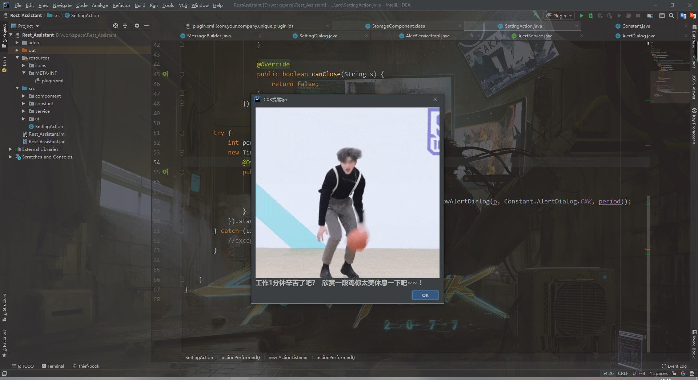

# Rest-Assistant
     
### IDEA插件——休息提示小助手，会在你设定的时间提醒你不要醉心于工作，要注意适当休息~
> 第一版提交只提供CXK模组，后续会考虑添加更多或让用户自定义  
>

---
## 使用方法
* 下载本目录下：Rest Assistant Git.jar 到本地
* Settings —— Plugins —— install plugins from disk，选择刚下载好的jar包
* 重启IDEA
* 快捷键： **Alt + C** 开始小助手配置；**Alt + S** 停止小助手提示功能
* 或者使用：Tools —— Assistant Setting 开始小助手配置；Tools —— Assistant Stop 停止小助手提示功能

## 二次开发、编译及打包
* 下载源码，导入IDEA即可

---
## 更新日志
#### 2021-06-10
* V1.2 
   * 新增：每日饮茶提醒小助手、摸鱼提醒小助手和努力工作小助手
#### 2019-12-24
* v1.1
   * 新增：杨超越、派大星、巨魔三个模型。加上之前的坤坤，现在有4个模型可供选择啦~
#### 2019-12-18 
* v1.0   
   * 更新项目配置文件
   * 新增编译后的jar文件
   * 完善Read Me
#### 2019-12-17 
* v1.0   
  * 初次提交，提供基础的提醒功能。第一版提交只提供CXK模组，后续会考虑添加更多或让用户自定义  